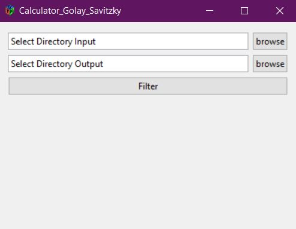
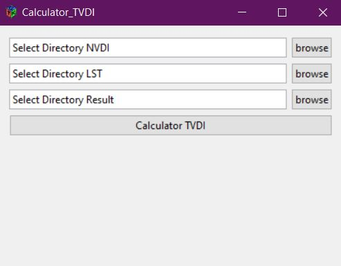

# TVDI Package R

### Description
- Sử dụng ảnh MODIS tính chỉ số TVDI
- Thực hiện được nhiều ảnh Raster cùng lúc
- Có thể sử dụng để tính toán các file ảnh lớn
- Giao diện UI tính toán xuất ảnh TVDI, xuất ảnh lọc Golay Savitzky
- Các function trong TVDI package
    - Golay_Raster
    - Golay_GUI
    - Mean_Raster
    - Mask_Multi_Raster
    - IQR_Raster
    - TVDI_process
    - TVDI_Largefiles_process
    - TVDI_GUI
- Các lưu ý:
    - Sau khi code trên các thư viện, cần chèn các thư viện vào phần DESCRIPTION
    - Note: vấn đề ở phần DESCRIPTION (các package sử dụng Imports thì các package có trong máy sẽ vào sẵn, trong khi hiện tại phải sử dụng Depends mới vào được)
    - Một vấn đề quan trọng là khi sử dụng các package có liên quan đến GDAL cần thêm phần SystemRequirements để R hiểu mà thêm vào

### How to Download and Install
``` r
install.packages("devtools")
library(devtools)
install_github("nguyenduclam/TVDIpk")
library(TVDIpk)
```

### How to use Pakages
1. Golay UI
    + `Golay_GUI()`
    + 
2. TVDI UI
    + `TVDI_GUI()`
    + 

### References
- http://r-pkgs.had.co.nz/
- Package MODIStsp: https://github.com/ropensci/MODIStsp
- https://rstudio.github.io/leaflet/
- https://github.com/rstudio/shiny-examples/tree/master/063-superzip-example